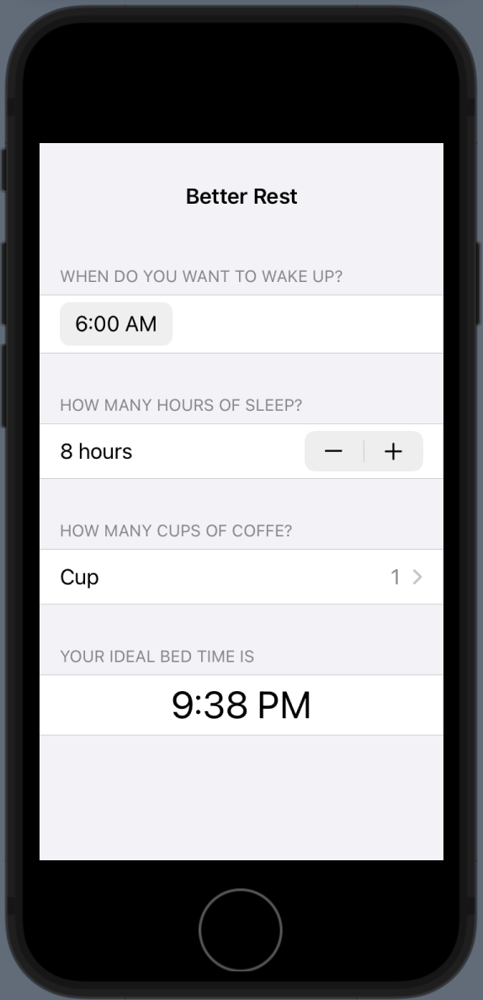

# betterRest

Hi there!

Today has been the right moment to explore some of Core ML capabilities, and I could not think a better subject than resting. So that, why don’t create an app that, according to some input, determines what time going to bed? To accomplish this prediction, I made use of a technique called linear regression. To be able to take advantage of this technique we must provide the algorithm with some data. The algorithm will split the data into two set (something like 75% - 25%), this way the bigger set used to study the relationship among the cases, and the smaller to try to guess the results, being able to measure how precise it is the model.

As input parameters the app will request the user to provide it with the time when waking up, the effective number of sleeping hours, and the amount of coffee in cups drank during the day. On the other hand, the app will predict what time the user should go to bed.

Main used features:

Picker: UI input component that allows the user to provide the system with a certain value picked out from a range of values.

DatePicker: belonging to pickers’ family but this time specialized in offering a way to input date and/or time to the user.

Stepper: another component that allows the user to input data containing in a range of values, this time by tapping a + or a – button. This UI element also let us set the increment or decrement to apply anytime we tap any of the buttons.

CoreML: Apple’s API to insert Machine Learning capabilities into our projects.

CreateML: An Apple’s framework that allows us to create and train our ML models before integrating it in our projects.

###### Main Screen

